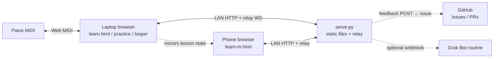
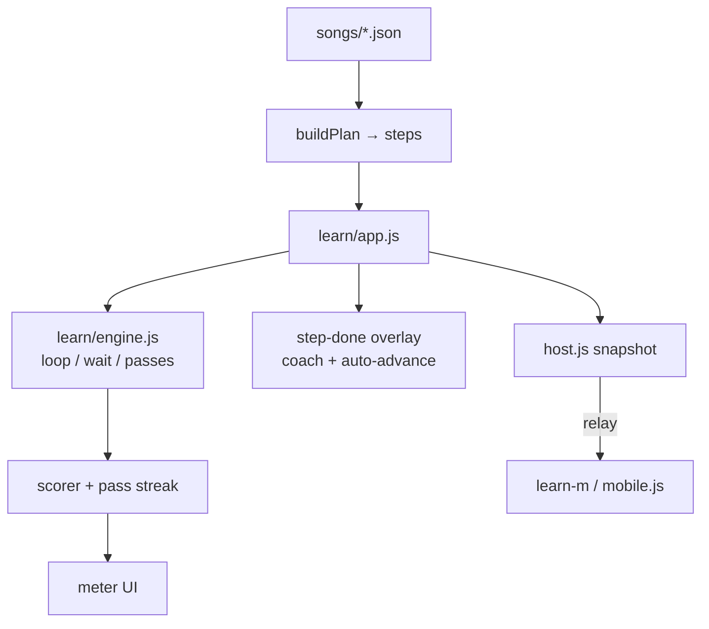
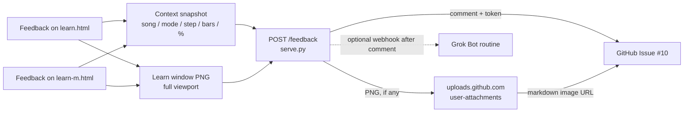

# MidiMan — architecture (simple)

Owner: **Noa** (Head of R&D). Keep this current when we change how pieces connect.  
Major architecture questions → consult Ishay. Otherwise decide, ship, document here.

Stack rules stay: **native ES modules, no build step, Web MIDI, `serve.py` relay.**

---

## Big picture

- **Laptop** owns the piano (Web MIDI) and most of the lesson logic.
- **Phone** is usually the music stand (mirror). iPhone has no Web MIDI.
- **`serve.py`** serves the app and runs the Learn relay room so laptop ↔ phone stay in sync.

---

## Learn tutor loop (I2 spine)

- Steps come from `plan.js` (listen → find notes → hand in time → …).
- “Notch up” = next **plan step**, not a separate difficulty system.
- Auto-advance only after `stepCleared` in `pass.js`: listen may finish on an empty pass; find-notes / in-time need a real scored streak (a skipped-all or never-played wrap must not jump).
- Phone shows title / where / meter / done card from the laptop snapshot.

---

## Feedback path (I7 + I21)

Fire-and-forget. GitHub is the inbox. No local sync product.

- Chip: **went well** / **friction** + optional one line + optional Learn screenshot.
- Token lives on the **server**, never in client JS. The browser POSTs only to `serve.py`.
- The PNG is uploaded to GitHub’s **user-attachments** host (the same place the web UI and `gh issue comment --attach` put a file). It is **not** committed via the Contents API, so shots never land on `main` or in app paths.
- Capture or upload failure is soft: the text comment still posts when GitHub will take it.
- If GitHub is down: quiet fail; play continues; lost submit OK.
- After a comment lands, optionally POST JSON to `MIDIMAN_FEEDBACK_WEBHOOK_URL` (Grok Bot: `Authorization: Bearer` sender key). Webhook errors never fail the pianist's Send.

---

## What we deliberately don’t do

- No bundler / build step for the app pages.
- No inventing a second “difficulty axis” beside the tutor plan.
- No making local files the source of truth for feedback.
- Cloud agents / Claude web build code; Ishay verifies with real MIDI.

---

## When this doc must update

Any PR that adds a new surface (e.g. Practice feedback), a new network hop, or changes laptop↔phone ownership should edit this file in the same PR.
