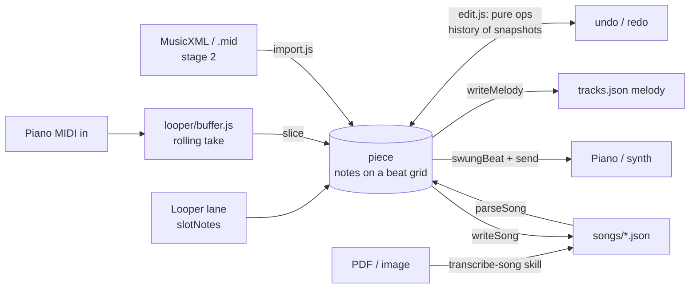
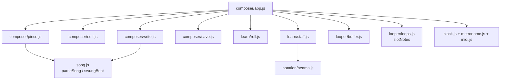

# MidiMan — the composer (architecture)

Owner: **Noa**. Status: **design, nothing built yet.** Parent doc: [architecture.md](architecture.md).
Stack rules stay: **native ES modules, no build step, Web MIDI, `serve.py` relay.**

> **Explain it to me like I'm 18.**
> You sit at the piano, press record, and play something — with the looper's backing
> track under you, or just a click. What you played becomes a list of notes, each with
> a start beat and a length, like a piano roll. You fix wrong notes and sloppy timing by
> dragging, or select a few bars and say "quantise" or "an octave up". When it sounds
> right, one button turns that list into a song file the Learn page can teach, or a
> melody a practice track can play. Everything else in this document is plumbing for
> those five sentences.

---

## The pitch

The composer is a fourth page, `composer.html`, that turns *playing* into a *piece* and
a piece into *something the app can teach*. It does three things: **record** (a take,
over a loop or over a click), **edit** (fix notes and timing, transform a selection),
and **save** — as a Learn sheet in `songs/` and/or a practice-track melody in
`tracks.json`. One person, one laptop; the phone is not involved.

---

## The one decision: a *piece* is a list of sounding notes on a beat grid

The app already agrees on one shape, and the composer adopts it. `src/song.js` says of
`parseSong`: *"Returns the document plus, per hand, a flat note list
`{ b, len, n, bar, hand, roll }` -- b and len in beats (a quarter = 1 beat)"*. The
looper's buffer keeps *"`{ b, len, p, v }`"*. The scorer, the roll, the staff playhead
and every transport think in beats. So:

```js
// a piece document -- the only thing the composer edits, plays, saves and loads
{
  v: 1,
  id: 'my-song', title: 'My song',
  bpm: 96, meter: '4/4', swing: '2/3', key: 'F', sharps: false,    // same as songs/*.json
  sections: [{ name: 'Whole song', from: 1, to: 8, hint: '', coach: '' }],
  grid: '1/8',      // null while a take is raw; '1/8' | '1/16' | '1/8T' once quantised
  notes: [          // sounding notes, straight positions, sorted by b
    { b: 0,   len: 0.5, n: 67, hand: 'rh', v: 80 },
    { b: 0.5, len: 0.5, n: 69, hand: 'rh', v: 74 },
    { b: 0,   len: 2,   n: 43, hand: 'lh', v: 60 },
  ],
  raw: null,        // the take as played, kept so Quantise is undoable: { notes, bpm }
}
```

`bar` is not stored — it is `Math.floor(b / beatsPerBar)`. Pitch is `n` as in `song.js`
(the looper's `p` is renamed on the way in). `v` is for playback and is dropped on save.

**The written form is generated, never edited.** Ties, rests, chord cells, tuplets and
beams are properties of the *edition*, not the music: a note across a bar line is one
note in the piece and two tokens (`D5:2 | ~D5:1`) in the file. So `songs/*.json` is a
*projection* of the piece, and so is a `tracks.json` melody. The reverse already
exists — `parseSong` — so a song file round-trips *as sound*, not as text:

```
parseSong(writeSong(parseSong(x))).notes  ==  parseSong(x).notes     (b, len, n, hand per note: slice 1's test)
```

The *text* need not come back the same, because spelling is an editorial choice, not
a function of the sound: City of Stars now writes `G3 ~G3` where the sound is a
quarter and `C4:2 ~C4:4` for a dotted half, because that is how the printed score
writes it. `writeSong` emits one canonical, readable spelling instead (the house rule
below), and a hand-tuned song file keeps its own: the composer writes only files it
created, or one the user chose to overwrite.

**Rejected: editing the bar strings.** Text is what we *store*, not what we *edit*: a
take does not arrive as bar strings; dragging a note across a bar line rewrites two
strings and a tie; a chord with unequal lengths is several `~` cells. The looper
already avoided this (`loops.js`: *"A loop is never rewritten. Everything here is
applied at expansion time"*). **Also rejected: raw note-on/off events** as the model —
the buffer already pairs them, and an unpaired off is a bug everywhere else.

### The conversions, exactly

| from → to | how | where |
|---|---|---|
| MIDI in → take | `makeBuffer(clock).feed(ev)`; `buffer.slice(from, to)` → `{ b, len, p, v }` from `from` | exists: `looper/buffer.js` |
| take → piece | `p`→`n`; `hand` by split point (`n < 60 ? 'lh' : 'rh'`, editable); `raw` = the take; `grid: null` | new: `piece.js fromTake` |
| looper lane → take | `slotNotes(slot, track, q)`: one chorus of `{ b, p, len, v }` | exists: `looper/loops.js` |
| song file → piece | `parseSong(doc)`: its `notes`, header copied | new: `piece.js fromSong` |
| piece → song file | `writeSong(piece)`, the sounding→written step below; one canonical spelling, sound-identical under `parseSong` | new: `write.js` |
| piece → track melody | `writeMelody(piece, hand, formBars)`: `[note, eighths]` cells, 8 a bar, top note wins — `loops.js toMelody`'s rule | new: `write.js` |
| MusicXML / MIDI file → piece | stage 2 importer, below | later: `import.js` |
| PDF → piece | stage 1: the `transcribe-song` skill writes `songs/*.json`, then `fromSong` | no app code |

**Sounding → written** (`writeSong`), per hand, per bar: (1) a note across the bar line
is cut there and continues as a `~` cell; (2) every onset or note-end inside the bar is
a cell boundary — notes starting together are a chord cell, a note still sounding at
the next boundary continues as `~`; (3) gaps become `r:n`; (4) lengths are written in
eighths as `:n`, `:1/2` or `:2/3`, the values `parseSong` reads. **The house rule** for
spelling: anything starting off the beat is an eighth tied over the beat line; an
on-beat value takes its plain length; a swing song gets `"beams": "beat"`. A length
that cannot be written is off the grid: `writeSong` refuses naming the hand and bar,
in `parseSong`'s voice, and the UI offers **Quantise**. A raw piece can be played and
kept as a draft, not saved as a sheet. Rolled chords (`/`) are not produced in v1.

**The grid is eighths** — a bar must sum to the meter in eighths (`parseBar`) — with
sixteenths (`:1/2`) and triplet eighths (`:2/3`) as the only finer values.

**Swing** is a header flag, not a position. Positions are always *straight* (the
offbeat eighth is `b = x.5`) and playback pushes them with `song.js`'s
`swungBeat(b, swing)`, exactly as Learn plays City of Stars. A take recorded under
swing has the swing *in* its timestamps, so quantise snaps each onset to the nearest
**swung** grid point (`loops.js` `gridOffsets(div, sw)` lists them) and stores that
point's *straight* position: quantise de-swings, playback re-swings. Raw pieces
(`grid: null`) play as recorded.

**Quantise, with the minimum of magic.** Snap every onset to the nearest point of the
chosen grid; snap every length to whole grid units, minimum one; clip a note that runs
into the next of the same pitch and hand. Strength is always 1 (the looper keeps its
dial for live playback). The take stays in `raw` and every operation returns a new
piece, so Quantise is one undo step like any other. No tempo detection, no groove
templates: the click is where the bar lines come from.

---

## Data flow



---

## The editor, as simply as possible

**Edit on the roll, read on the staff.** Both views exist. The roll
(`src/learn/roll.js`) is an SVG with time on x and pitch on y, so moving a note is
moving a rectangle, and `rollBeat(x, width, loopLen)` already turns a pointer into a
beat. The staff (`src/learn/staff.js`) has `beatAt(cx, cy)` too, but a pitch change
there is a re-engrave per drag frame and a beam is *"one glyph over several notes"*.
So the roll edits and the staff previews — rendered from `parseSong(writeSong(piece))`
via `staff.render`, so **the preview *is* the written form you will save**: a tie
`writeSong` gets wrong is visible before you save. The beams engine (`src/notation/beams.js`) is untouched.

**Selection** is a time range × hands, `{ from, to, hands: ['rh'] }` in beats: drag
across the roll (snapped to bars with the `barsTouched` rule Learn's loop drag uses),
toggle hands with two chips. A click on one rectangle selects that note alone.

**Operations** (single note or selection) and **transforms** (selection) are pure
functions in `edit.js`, `(piece, sel, arg) → piece`:

| operation | transform |
|---|---|
| move in time (drag, snaps to `grid`) | quantise to `1/8` / `1/16` / `1/8T` |
| change pitch (drag up/down, `↑`/`↓`) | transpose ±n semitones, octave up/down |
| change length (drag the right edge) | shift in time ±one grid unit / ±a bar |
| delete, insert (click an empty cell: one grid unit at that pitch) | double / halve speed (`b` and `len` ×2 or ÷2, bars follow) |
| split at the playhead, merge with next same-pitch note | swap hands / send to other hand |
| | humanise off: velocities to one value; on: restore from `raw` |

**Undo / redo** is an array of piece snapshots and an index: push after every
operation, `undo` moves the index back. Pieces are small plain objects (a few thousand
notes), so copying is cheap, and no operation can half-apply. The looper's per-lane
`undo: []` is the same idea one level up.

**Playback** is Learn's recipe without the tutor: `makeClock`, the `makeMetronome`
click, and `send([0x90, n, v], clock.time(swungBeat(b, swing)))` for each note in a
look-ahead window from a `setInterval` tick, as `looper/engine.js` does
(`LOOKAHEAD_MS = 120`, `TICK_MS = 25`). Loop a selection to audition an edit.

### Modules

Five new files in `src/composer/`, all but one pure and testable under `node --test`:

| file | one sentence |
|---|---|
| `piece.js` | The piece document: `fromTake`, `fromSong`, `validate`, `barsOf`, `notesIn`. |
| `edit.js` | The operations and transforms as pure functions, plus `makeHistory()` for undo/redo. |
| `write.js` | Sounding → written: `writeSong(piece)` → song-file text, `writeMelody(piece, hand, formBars)` → a `melodies` entry. |
| `save.js` | Where a piece goes: localStorage drafts, a download, `POST /songs` to `serve.py`, the clipboard; and the sheet-details defaults. |
| `app.js` | `composer.html` wiring: transport, roll + staff, selection, keys, MIDI in, import from the looper's saved set. |

Stage 2 adds a sixth, `import.js`. Reused unchanged: `clock.js`, `metronome.js`,
`midi.js`, `synth.js`, `song.js`, `looper/buffer.js`, `looper/loops.js`
(`slotNotes`), `learn/roll.js`, `learn/staff.js`, `notation/beams.js`, `keyboard.js`.



---

## Recording, with or without loops

**With a loop.** `looper.html` gains one button, **Open in Composer**. The looper
already saves its lane set to localStorage (`middleman.looper.<trackId>`: layers,
`fromBar`, `lenBars`, `mode`, `follow`, `oct`); the composer reads that key, loads the
track, and expands each lane with `slotNotes`, so repeats, follow-the-changes
transpositions and octave shifts arrive as they sounded. Each lane is one take with a
**hand** chip (lane 1 → right, lane 2 → left by default; a lane can be dropped). The
chorus gives the bars; the track gives `bpm`, `swing`, `sharps`. Overdub layers are
already flattened by `slotNotes` (`slot.layers.flat()`) — undoing a layer is the
looper's job, before the hand-off.

**Without a loop** means *a free take over the click*. Pick meter, tempo and swing
(defaults `4/4`, 90, straight), press **Record**, hear the looper's four-beat count-in
(`COUNT_IN = 4`, clock started at `-4`), play. The clock is the ruler: beat 0 is the
first downbeat after the count-in, so bar lines are known, not inferred. **Stop** rounds
the end up to a bar and `buffer.slice(0, end)` is the take. Record with a piece loaded
is an overdub: the piece plays, the new take merges in as notes for the chosen hand,
one undo step. A take with no click is not offered in v1.

---

## Save and export

There is no backend state and there should not be one: the repo is the source of
truth and `serve.py` is a static server with a relay. Two honest paths:

- **Anywhere: download.** `writeSong(piece)` → `my-song.json` via a download link; the
  melody JSON to the clipboard, as the looper's **Copy lane as melody** does today. The
  user drops the file into `songs/`, adds it to `songs/index.json`, commits.
- **Locally: `POST /songs/<id>.json`** to `serve.py`, which writes the body into
  `songs/` and adds the id to `index.json` if missing. `id` must match `^[a-z0-9-]+$`,
  the body is JSON under the existing `BODY_MAX`, and an existing file is replaced only
  with `?overwrite=1`. The browser runs `parseSong` before sending, so the server never
  understands music. Same shape as `/feedback`: the page POSTs, the server owns the
  side effect, a failure is a grey status line. The write lands in the working tree;
  the commit is still a human's `git add songs/`. The phone precache stays a hand
  edit — `sw.js` names songs in `SHELL` and bumps `VERSION` — in the PR that commits
  the song.

**What a Learn sheet needs beyond notes**, and how the composer asks: `title` (the one
required field); `id` (slugged from it); `key` (guessed as the signature needing the
fewest accidentals for the notes present — ten deterministic lines — in an editable
dropdown); `practiceBpm` (`parseSong` already defaults it to 60 % of `bpm`); `sections`
(default one, *Whole song*, as `parseSong` does when the field is missing; add one by
selecting bars and pressing **Name section**); `hint` and `coach` (blank — `plan.js`
treats `coach` as optional, and a hint is a sentence you write later in the JSON). One
small sheet, most fields you can leave alone, nothing modal until **Save as sheet**.

**Practice track.** A track in `tracks.json` is a *generator* — `pattern`, `form`,
`root` — not a score, so "save as track" means **attach a melody to a track**: the one
the loop was recorded over, as the looper does today (`blues-c-lane1` is already in
`tracks.json`). `writeMelody` keeps `toMelody`'s rules: 4/4, a multiple of the form,
top note wins on a shared eighth. A free take with no track behind it is saved as a
sheet; Learn's free practice, with its loop and tempo, *is* the practice view for a
two-hand piece.

---

## The PDF drop-in path, staged honestly

1. **Now — `.claude/skills/transcribe-song`** (being built in parallel). An agent reads
   the PDF or photo and writes `songs/*.json` bar by bar. River Flows in You came in
   this way, and its history is the argument for the composer: the first vision read
   *"got the piece wrong"* and needed a second pass. The skill's output opens in the
   composer through `fromSong` for corrections. Zero app code.
2. **Next — an in-app importer for MusicXML and MIDI files** (`import.js`). MusicXML is
   XML, so `DOMParser` reads it with no dependency: `<divisions>`/`<duration>` give `b`
   and `len`, `<staff>` the hand, `<tie>` merges cells into one note,
   `<time-modification>` marks tuplets, `<time>`/`<key>` fill the header. A Standard
   MIDI File is a two-hundred-line parser (variable-length deltas, tempo meta, on/off
   pairs), hand from the track or the split point. Both are deterministic and
   fixture-testable; MuseScore exports both, and so does Audiveris (open-source OMR),
   so "PDF → Audiveris → MusicXML → drop on the page" works offline before any model.
3. **Later — OMR by a model call.** Drop the PDF on `composer.html`; the page POSTs it
   to `serve.py`, which holds the API key as it holds the feedback token, and asks a
   vision model for the song file (or MusicXML, which stage 2 already reads). The
   result opens in the editor, because it will *never* be entirely right.

**Build 2 before 3.** The importer needs no key and no network and is the landing code
the model output needs anyway; the model call is then forty lines in `serve.py`, not a
pipeline. And none of it is worth much without the editor of slices 3–4.

---

## Build order

Each slice is one GitHub issue in the [issue format](issue-format.md) — action title,
user story, checkbox ACs. The AC given here is that issue's first Pass line.

| # | Title (as the issue) | Ships | First AC |
|---|---|---|---|
| 1 | **Round-trip a song through a piece** | `piece.js`, `write.js`, `test/composer.test.mjs`. No UI. *A weekend.* | For all three songs, `parseSong(writeSong(parseSong(doc)))` has the same note list as `parseSong(doc)` — `b`, `len`, `n`, `hand` per note, ties and tuplets included — and the written text follows the house rule. |
| 2 | **Open and play a piece on the composer page** | `composer.html`, `app.js`: a song or the looper's saved set, roll + staff, play/stop with click. | City of Stars plays swung with the playhead on both views; the last blues set opens as two hands. |
| 3 | **Record a free take and quantise it** | count-in, buffer, `fromTake`, split point, Quantise, undo/redo, localStorage draft. | Eight bars over the click appear on the roll; Quantise 1/8 puts every note on the staff; Undo brings the raw take back. |
| 4 | **Edit notes and selections on the roll** | selection, the operations and transforms, keys. | Drag a wrong note to pitch; select bars 3–4, Octave up; the staff preview follows. |
| 5 | **Save the piece as a Learn sheet** | `save.js`, sheet details, download, `POST /songs` in `serve.py` + a `serve.test.mjs` case. | Save writes `songs/<id>.json`, adds it to `index.json`; Learn lists and teaches it after a refresh. |
| 6 | **Send a looper lane to the composer and back to its track** | **Open in Composer** in `looper.html`; `writeMelody`; melody to clipboard / `tracks.json`. | A captured blues lane opens as the right hand, is cleaned, and comes back engraved on the practice view. |
| 7 | **Import a MusicXML or MIDI file** | `import.js`, drop zone, fixture tests. | A MuseScore export of Let It Be matches `songs/let-it-be.json` bar for bar after Quantise 1/8. |
| 8 | **Transcribe a dropped PDF** | `serve.py` model call, drop handler. Only once 1–7 hold up. | A one-page PDF opens with bar count and key right; wrong notes are fixable in place. |

**Not in v1:** recording without a click (tempo detection); dynamics or pedal marks in
the file; rolled chords and grace notes; more than one voice per hand; chord symbols
and lyrics; editing on the phone; cloud or multi-user save; audio input; a `tracks.json`
editor for `pattern` / `form` (attach a melody, nothing more).

---

## What we deliberately don't do

- No second note format: the piece is `parseSong`'s flat list with a header, and the
  file formats are projections of it.
- No server state: `serve.py` may write a file into `songs/` on request and keeps no
  record of it; git is the history.
- No rewriting the looper or Learn: one button in the looper, one `render` call into
  the existing staff and roll. No new dependency: XML and MIDI parsing are stdlib-sized.
