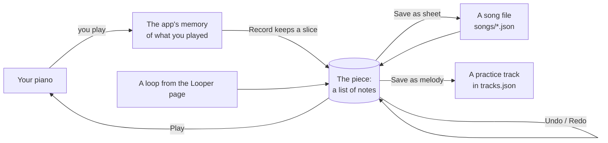
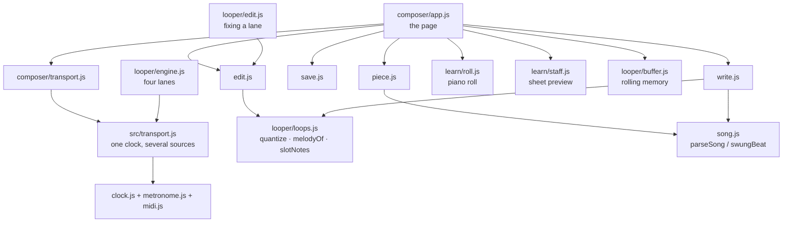

# MidiMan — the composer, explained simply

Owner: **Noa**. Parent doc: [architecture.md](architecture.md).
Stack rules stay: **native ES modules, no build step, Web MIDI, `serve.py` relay.**
Status: **steps 1–6 of the build order are built** (`composer.html`, `src/composer/`,
`POST /songs` in `serve.py`, **Open in Composer** in the Looper). Steps 7–8 (import
MusicXML / MIDI, transcribe a PDF) are not started.

Since then the composer and the Looper have been pulled onto **one core**, which is
the important thing to know before changing either: one transport (`src/transport.js`),
one melody writer, one quantise, and note editing on the Looper's own lanes. The two
pages stay two pages; what they share is the music, not the screen.

This page is written so that a 15-year-old who plays a bit of piano can follow it.
If a paragraph needs a dictionary, the design is too complicated — tell Noa.

---

## What it is, in one breath

You sit at the piano and press **Record**. You play something. The app writes down
every note you played. You fix the wrong notes and the sloppy timing on screen.
Then you press **Save**, and the app can now *teach you* that piece on the Learn
page, the same way it teaches City of Stars.

That's the whole product. Everything below is how we make those four sentences true.

---

## The one big idea: a piece is a list of notes

Imagine a spreadsheet. Every row is one note. Every row has four things:

| when it starts | how long it lasts | which key | which hand |
|---|---|---|---|
| beat 0 | half a beat | G above middle C | right |
| beat 0.5 | half a beat | A | right |
| beat 0 | 2 beats | low G | left |

"Beat" means the click of a metronome. Beat 0 is the first click of the piece, beat 4
is the first click of the second bar (in 4/4 time), beat 4.5 is halfway between clicks
4 and 5. That's it. No bars, no ties, no rests, no note stems: just *when*, *how long*,
*which key*, *which hand*.

We call that list a **piece**. It is the only thing the composer ever works on:

- **Recording** makes a piece.
- **Editing** changes a piece.
- **Playing** reads a piece.
- **Saving** turns a piece into a file.

Why a list and not sheet music? Because sheet music is *complicated on purpose*. A
note that runs over a bar line is drawn as two notes joined by a curved line (a tie).
A pause is drawn as a rest. Three notes squeezed into the time of two get a little "3"
over them. All of that is about *how it looks on paper*, not about *what you played*.
If you had to edit sheet music, dragging one note across a bar line would mean rewriting
two bars and inventing a tie. Dragging a row in a list is just changing one number.

The app already thinks this way. The Learn page reads a song file, and the first thing
it does (in `src/song.js`, a function called `parseSong`) is turn the bars into exactly
this kind of list. The looper stores what you play in the same kind of list. So the
composer is not inventing anything, it's just using the list everybody already agrees on.

### Sheet music is printed *from* the list, never edited by hand

Think of the list as the thing and sheet music as a photo of it. You don't edit a
photo to change the thing; you change the thing and take a new photo.

So when you save, the app *prints* the list into a song file (the format the Learn page
reads, one line of text per bar). When it does that it follows one house rule so that
the printed version always looks the same: a note that starts between two clicks is
written as a short note tied to the next one, the way the City of Stars score prints
it. If you open a song file in the composer and save it again, the notes come out
identical. The text might be spelled a little differently, because there is more than
one correct way to write the same rhythm, and that's fine. We test this: every song in
`songs/` goes list → file → list and comes back the same.

Some rhythms can't be written down at all: if a note starts at beat 2.37, no sheet
music can show that. The composer says so ("right hand, bar 3: off the grid") and
offers the **Quantise** button described below. You can still play and keep a rough
piece as a draft; you just can't turn it into a sheet until it fits the grid.

---

## The picture



---

## Recording: the app is always listening

The Looper page already keeps a rolling memory of everything you play, stamped with
the beat it landed on (about two minutes' worth). Nothing is ever "armed". So
**Record** doesn't start anything, it just says *"keep from here"*, and **Stop** says
*"to here"*. Pressing Record a moment late loses nothing, because the memory was
already there.

The metronome is the ruler. When you press Record you hear one bar of click first
(the count-in), and the first click after that is beat 0. Because the click never
lies, the app always knows where the bar lines are. It never has to *guess* your tempo,
which is the thing that makes other apps get this wrong.

You can record in three ways:

1. **Over a click only.** Pick a time signature and tempo (4/4 and 90 to start), press
   Record, play. Stop rounds the end up to a whole bar.
2. **Over a piece that's already loaded.** The piece plays, you play along, and what you
   add is merged in as the hand you chose. That's an overdub.
3. **From the Looper.** The Looper page gets one button, **Open in Composer**. Whatever
   loops you had on the lanes arrive as a piece, lane 1 as the right hand and lane 2 as
   the left (you can swap). Repeats and octave shifts arrive as they sounded.

---

## Editing: rectangles, magnets and Undo

The composer shows the piece two ways at once:

- **The piano roll** (top). Time goes left to right, pitch goes bottom to top, each note
  is a rectangle. This is where you edit. Drag a rectangle up or down to change its
  note; left or right to move it in time; drag its right edge to make it longer. Click
  an empty spot to add a note, press Delete to remove one. Both views already exist on
  the Learn page; we reuse them.
- **The sheet music** (bottom). This is a preview of what will be saved. It's printed
  from the list every time you change something, so if the printed version looks wrong
  you see it before you save, not after.

You can also select a stretch of bars and change all of it at once:

| what you say | what happens |
|---|---|
| **Quantise** | Every note snaps to the nearest grid line, like a magnet. You choose the grid: eighths, sixteenths, or triplets. |
| **Octave up / down**, **Transpose** | Every selected note moves up or down. |
| **Shift** | Every selected note moves left or right by a grid step or a bar. |
| **Double / halve speed** | The selection is stretched or squeezed in time. |
| **Swap hands** | Right-hand notes become left-hand notes and back. |
| **Humanise off** | Every note gets the same loudness. On brings the original loudness back. |

**Undo** works like this: before every change the app keeps a copy of the whole list.
Undo goes back one copy, Redo goes forward. Pieces are small (a few thousand rows at
most), so keeping copies is cheap, and there's no clever bookkeeping to get wrong. The
looper does the same thing for its lanes.

### Editing in the looper, too

The same fixing works on the Looper page, on a lane's own little roll. Click a note to
pick it — it lights up, and so does every repeat of it further along the form, because
they are all the same note. Drag it to move it, drag its right end to make it longer or
shorter, or use the arrow keys: left and right move it in time (onto the lane's grid, if
the grid is on), up and down move it a semitone. `[` and `]` change its length, Delete
loses it, and Esc lets the keys go back to being the lane's.

The rule for *where the change is kept* matters, because a lane is not a piece: it is
the layers of what you played, bent on the way out by the knobs (quantise, octave,
follow the changes, level). So an edit **flattens the lane's layers into one edited
layer, and pushes the layers it replaced onto the lane's undo stack** — the same stack
that puts a removed overdub back. Three things follow, and they are the reason for the
rule:

- **U undoes an edit exactly as it undoes an overdub.** One key, one meaning.
- **The take as you played it is never lost** while it is on that stack.
- **The knobs still apply on top.** Quantise is still a playback setting, not something
  baked into the notes, so turning it off still gives you back your own timing.

A drag says where the note goes *in the lane's own coordinates* — its beat inside the
loop, its pitch as played — and the roll then draws it wherever the knobs put it. That
is why dragging a note in bar 9 of a repeating loop moves the note in bar 1: bar 9 is a
picture of bar 1.

### Swing, in one paragraph

Some music (City of Stars, most jazz) is played with **swing**: the notes between the
clicks come a little late, so pairs of eighths go *long–short* instead of *even–even*.
The piece stores every note *as if it were straight* and the player pushes the offbeat
notes late as it plays, which is exactly what the Learn page already does. When you
record under swing, your timing has the swing baked in, so Quantise snaps to the
*swung* grid lines and then stores the straight position. In other words: quantise takes
the swing out, playback puts it back. Nobody has to think about it.

---

## Saving

There is no cloud and no account. The repository *is* the library. Two ways out:

- **Anywhere: download.** Save as sheet gives you `my-song.json`. You drop it in the
  `songs/` folder, add its name to `songs/index.json`, commit. Save as melody copies a
  practice-track melody to the clipboard, like the Looper's **Copy lane as melody**.
- **On the laptop that runs the app:** the composer sends the file to `serve.py`, which
  writes it into `songs/` and adds it to the index. The next time you open Learn, the
  song is there. Committing it to git is still a human's job.

Before saving as a sheet the composer asks for a **title** (the only thing it can't
guess). It fills in the rest: an id made from the title, the key signature (the one
that needs the fewest sharps or flats for the notes you used, and you can change it),
a practice tempo (60 % of the real one), and one section called *Whole song*. Select some
bars and press **Name section** to add more. Coach lines and hints stay blank; you write
those later if you want them.

A **practice track** is different from a song: it's a chord pattern that repeats, and a
melody you play over it. So "save as track" means *attach my melody to the track I
recorded over*, which is exactly what the Looper's melody button does today.

---

## Getting sheet music *in* (the PDF path)

People will want to drop a PDF of a score and get a piece. That's hard to do well, so
we do it in three stages, easiest first, and each stage stays useful when the next one
lands:

1. **Now.** A skill in this repo (`transcribe-song`) lets an AI agent read a PDF or a
   photo and write the song file bar by bar, checked by tests. The result opens in the
   composer for fixing. No app code needed.
2. **Next.** Drop a **MusicXML** or **MIDI** file on the composer page. MusicXML is what
   MuseScore and free scanning tools export; MIDI is what every keyboard exports. Both
   are plain formats we can read with a few hundred lines and test with fixture files.
   "PDF → free scanner → MusicXML → drop it on the page" then works with no AI at all.
3. **Later.** Drop the PDF itself. The page sends it to `serve.py`, which asks a vision
   model for the notes. The answer will never be perfect, which is why the editor comes
   first: the model's output is just another piece to fix.

---

## How it gets built, in order

Each step is one GitHub issue ([issue format](issue-format.md)). Each is done when its
first acceptance line passes.

| # | Step | Done when |
|---|---|---|
| 1 | **A song goes list → file → list unchanged.** Pure code, no screen. | Every song in `songs/` round-trips with the same notes. |
| 2 | **Open and play a piece on `composer.html`.** | City of Stars plays with swing and the playhead moves on both views. |
| 3 | **Record over the click and quantise.** | Eight bars appear on the roll; Quantise puts every note on the staff; Undo brings the raw take back. |
| 4 | **Edit notes and selections on the roll.** | Drag a wrong note to the right key; select bars 3–4, Octave up; the sheet preview follows. |
| 5 | **Save as a Learn sheet.** | Save writes `songs/<id>.json`; Learn lists it after a refresh. |
| 6 | **Looper → composer → practice track.** | A recorded blues lane opens as the right hand, gets cleaned up, and comes back on the practice view. |
| 7 | **Import MusicXML / MIDI.** | A MuseScore export of Let It Be matches our `let-it-be.json` after Quantise. |
| 8 | **Transcribe a dropped PDF.** Only after 1–7 hold up. | A one-page PDF opens with the right bars and key; wrong notes fixable in place. |

**Not in the first version:** recording without a click; loudness and pedal marks in
the file; rolled chords and grace notes; two melodies in one hand; chord symbols and
lyrics; editing on the phone; cloud save; recording from a microphone.

---

## What we deliberately don't do

- **No second note format.** The piece *is* the list `parseSong` already makes, plus a
  header. Song files and track melodies are printouts of it.
- **No server state.** `serve.py` writes a file when asked and remembers nothing. Git is
  the history.
- **No rewriting the Looper or Learn.** One button in the Looper, and the composer calls
  the existing roll and staff drawing code. No new dependencies: reading XML and MIDI
  files needs nothing we don't already have.
- **No second copy of the music.** Where the two pages did the same thing twice — the
  scheduling loop, the melody writer, the quantise grid, what a drag does to a note —
  there is now one of it, and the other page calls it. Merge the core, not the pages:
  the Looper is a set of lanes over a backing track and the composer is a piece on a
  staff, and neither wants to become the other.

---

## For whoever builds it: the details

You can stop reading here. This part is the same design in code terms.

### The piece, as data

```js
{
  v: 1,
  id: 'my-song', title: 'My song',
  bpm: 96, meter: '4/4', swing: '2/3', key: 'F', sharps: false,   // same header as songs/*.json
  sections: [{ name: 'Whole song', from: 1, to: 8, hint: '', coach: '' }],
  grid: '1/8',       // null while a take is raw; '1/8' | '1/16' | '1/8T' once quantised
  notes: [           // the list: start beat, length in beats, MIDI key, hand, loudness
    { b: 0,   len: 0.5, n: 67, hand: 'rh', v: 80 },
    { b: 0.5, len: 0.5, n: 69, hand: 'rh', v: 74 },
    { b: 0,   len: 2,   n: 43, hand: 'lh', v: 60 },
  ],
  raw: null,         // the take exactly as played, so Quantise can be undone
}
```

Positions are always straight; `swungBeat(b, swing)` from `song.js` pushes them at
playback. The bar number is `Math.floor(b / beatsPerBar)`. `v` is dropped on save.

### Files

Everything lives in `src/composer/`. All but the last are pure functions with tests.

| file | what it does |
|---|---|
| `piece.js` | Makes and checks pieces: from a take (`fromTake`), from a song file (`fromSong`), `validate`, `barsOf`, `notesIn`. |
| `edit.js` | Every edit as a function `(piece, selection, arg) → new piece`, plus `makeHistory()` for Undo/Redo. Quantise is `looper/loops.js quantize` with the result written straight. |
| `write.js` | Prints a piece: `writeSong(piece)` → a song file; `writeMelody(piece, hand, bars)` → a track melody, through `looper/loops.js melodyOf`. Throws, naming hand and bar, when a note is off the grid. |
| `save.js` | Where a piece goes: a draft in localStorage, a download, `POST /songs` to `serve.py`, the clipboard. Also the Save-as-sheet defaults (id, key guess, practice tempo). |
| `transport.js` | A thin adapter: makes the piece a source on `src/transport.js`, puts the swing back with `swungBeat`, loops a selection, counts in for a take. |
| `app.js` | The `composer.html` page: transport, record, roll + staff, selection, keys, MIDI in, import from the Looper's saved set. |

Shared with the Looper rather than copied — this is the list to check before writing
anything new here:

| file | what both pages use it for |
|---|---|
| `src/transport.js` | The one scheduling loop: clock, click, look-ahead window, `emitNotes`, stop and panic. `looper/engine.js` and `composer/transport.js` are both built on it. |
| `looper/loops.js` | `quantize` and `gridOffsets` (where the grid falls, swung), `melodyOf` (a line as a `melodies` entry), `slotNotes` (a lane expanded). |
| `composer/edit.js` | The note operations themselves — move, repitch, length, delete — which `looper/edit.js` applies to a lane. |
| `looper/buffer.js` | The rolling memory a take is sliced out of. |

Reused as they are: `clock.js`, `metronome.js`, `midi.js`, `synth.js`, `song.js`,
`learn/roll.js`, `learn/staff.js`, `notation/beams.js`, `keyboard.js`.



### Printing rules (`writeSong`), per hand, per bar

1. A note that crosses the bar line is cut there and continues as a `~` cell.
2. Every note start or end inside the bar is a cell boundary. Notes starting together
   are one chord cell; a note still sounding at a boundary continues as `~`.
3. Gaps are `r:n`.
4. Lengths are eighths: `:n`, `:1/2`, `:2/3`, the values `parseSong` reads.
5. House rule: a note that starts off the beat is an eighth tied over the beat line; an
   on-beat note takes its plain length; a swing piece gets `"beams": "beat"`.

The grid is eighths, with sixteenths and triplet eighths as the only finer values.
A bar must add up to the meter, as `parseBar` demands.

### Quantise

Snap each onset to the nearest point of the chosen grid (the *swung* points when the
piece swings, storing the straight position); snap each length to whole grid units,
minimum one; clip a note that runs into the next of the same pitch and hand. Strength
is always 1. `raw` keeps the take, so this is one Undo step like any other.

### Playback and recording

Playback **runs on the looper's engine**, not on a scheduler of its own. `src/transport.js`
is the one scheduling loop in the app: a clock, a click, a look-ahead window walked on a
`setInterval` tick, and `emitNotes`, which knows how to repeat a source every `loop`
beats. A lane is a source, the backing track is a source, and a piece is a source — a
selection being that same piece with a shorter cycle, which is how auditioning two bars
stays one `loop:` rather than a second transport.

What `composer/transport.js` adds is what only a piece needs: positions in a piece are
*straight*, so it voices them through `swungBeat` on the way to the port (once per edit,
not once per round), and it stops at the end instead of going round for ever.

Recording is `makeBuffer(clock).feed(ev)` for every MIDI event, then `buffer.slice(0, end)`
on Stop, with the clock started at `-beatsPerBar` for the count-in.

### Save endpoint

`POST /songs/<id>.json` on `serve.py`: `id` matches `^[a-z0-9-]+$`, the body is JSON
under `BODY_MAX`, an existing file is replaced only with `?overwrite=1`, and the file
name is added to `songs/index.json` when missing. The browser runs `parseSong` before
sending, so the server never has to understand music. The phone's offline cache
(`sw.js`) stays a hand edit in the PR that commits the song.
